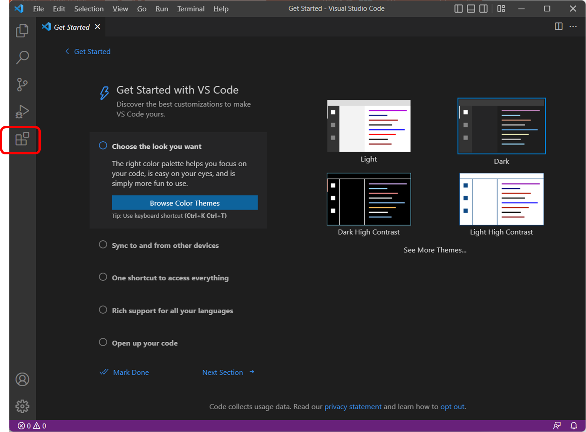
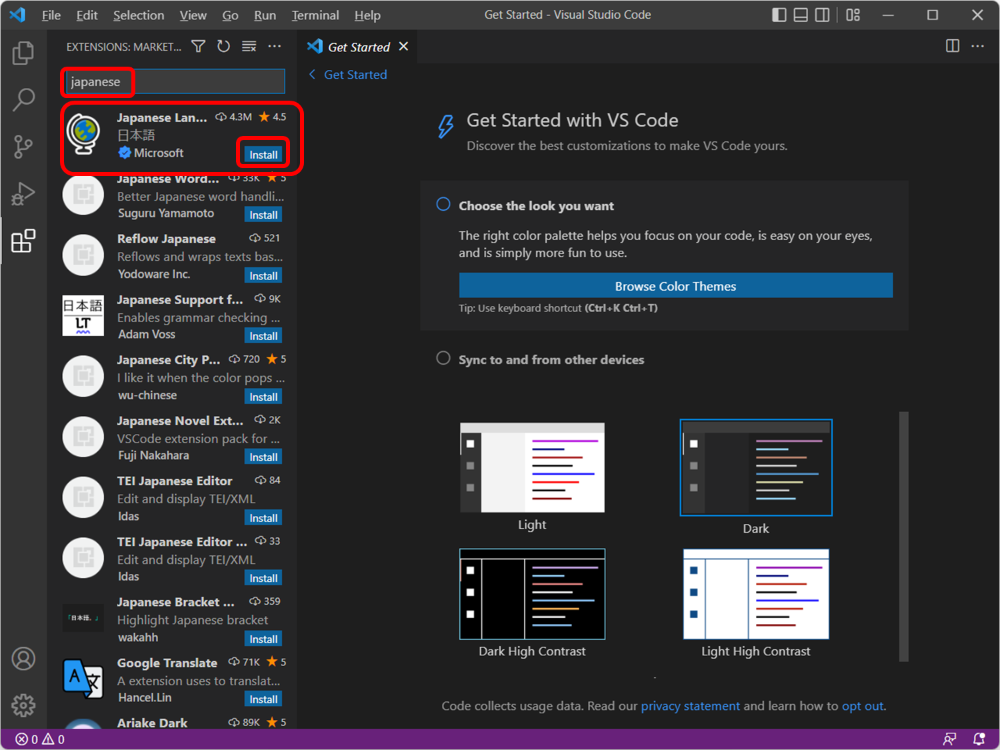
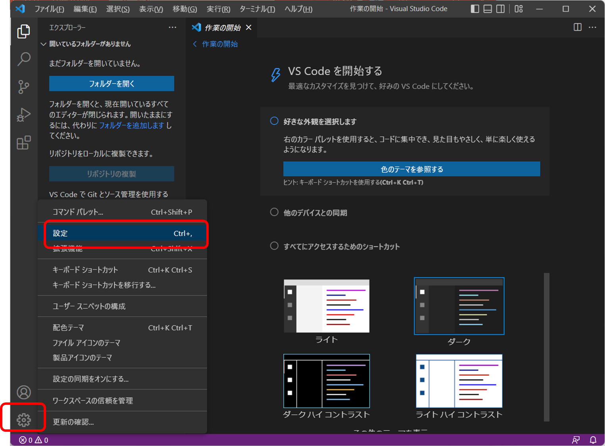
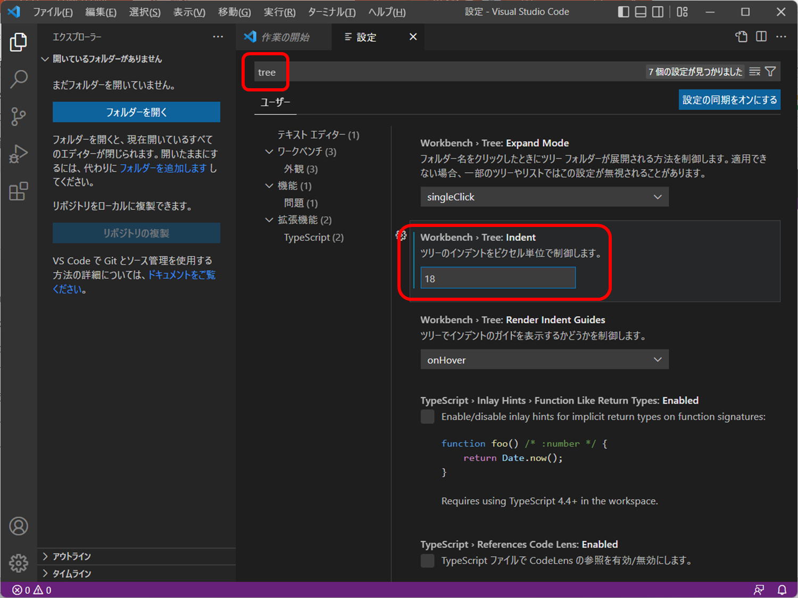

# Visual Studio Codeの設定

## 1. Visual Studio Codeを起動

## 2. 機能拡張(Extensions)を押す　

## 2. 日本語化されていない場合

「japanese」で検索。

「Japanese Language Pack...」のところに「Install」が表示されていれば、まだインストールされていない。

インストールされていない場合、「Install」を押してインストールする。

[Install]が出ない場合は、インストールされている。

インストールされていて、まだ日本語化されていない場合、一度、Visual
Studio Codeを終了して、再度起動すればいい。

## 3. 左下の「管理」Manageボタン(歯車の形)をクリックし、「設定」を選ぶ

## 4. 各種設定

「tree」で検索し、「Workbench > Tree: Indent」を「8」→「18」など大き目に

「font size」で検索し、「Editor: Font Size」を「14」→「18」など大き目に

「wrap」で検索し、「Editor: Word Wrap」を「off」→「on」に

「white」で検索し 「Editor: Render Whitespace」を「selection」→「all」に

## 5. 配色テーマの変更

左下の「管理」ボタン(歯車の形)をクリックし、「テーマ」→「配色テーマ」を選ぶ
