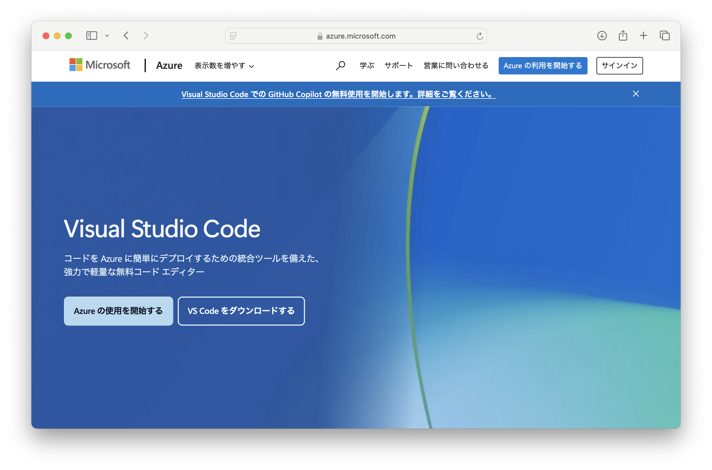
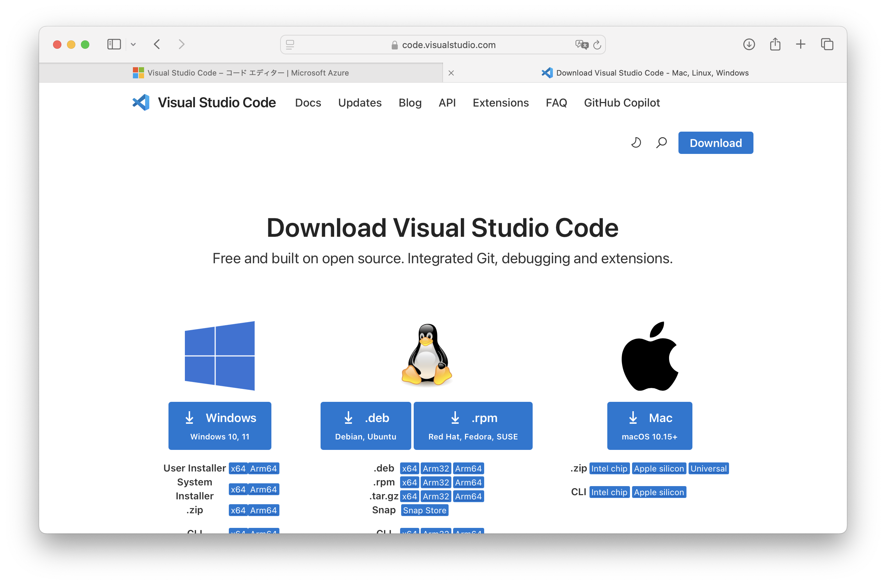
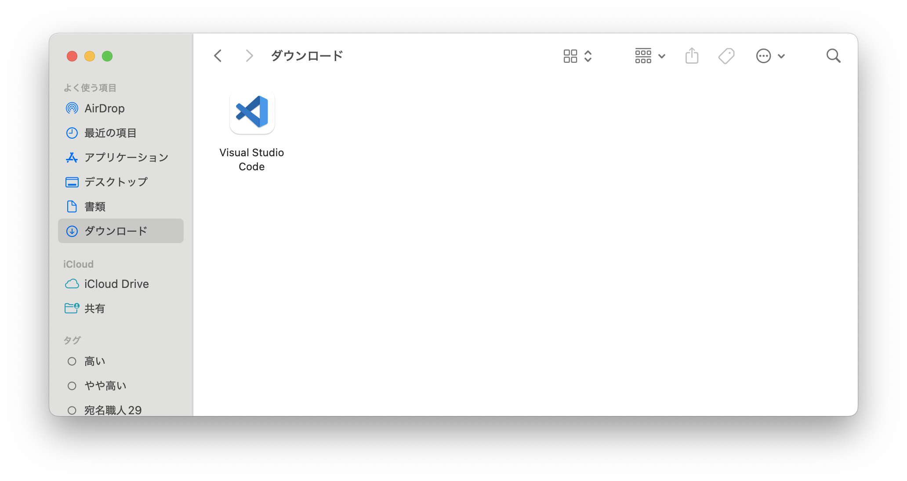

# ​​Visual Studio Codeのインストール

## 1. ブラウザを起動する

## 2. 「visual studio code」で検索する。

## 3. 検索結果から公式サイトの「Visual Studio Code - コードエディター...」を選ぶ


## 4. 公式サイトで「VS Codeをダウンロードする」を選ぶ

# 

## 5. Mac版を選ぶ



## 6. 「ダウンロード」フォルダにダウンロードされる

Safariの場合、自動的に展開され、「Visual Studio Code」というファイルができている。

他のブラウザの場合、「VScode-darwin -universal.zip」などが展開されずに入っているので、ダブルクリックして展開する。




## 7. 「アプリケーション」に移動
「Visual Studio Code」を左のペインの「アプリケーション」にドラッグアンドドロップする。

## 8. Visual Studio Codeを起動する
「アプリケーション」の中の「Visual Studio Code」をダブルクリックして、起動する。
開いてもいいかと聞かれたら「開く」

## 9. ターミナルからVisual Studio Codeを起動できるように設定
ターミナルで以下のように打つ。

```sh
touch ~/.zshrc
open -a /Applications/Visual\ Studio\ Code\ -\ Insiders.app/ ~/.zshrc
```

Visual Studio Codeでファイルの末尾に以下の行を加えて、保存する。
```sh
alias code='open -a /Applications/Visual\ Studio\ Code\ -\ Insiders.app/'
```

ターミナルで以下のように打ち、変更を読み込む
```sh
source ~/.zshrc
```

# 10. ターミナルからVisual Studio Codeを起動

ターミナルで以下のように打つ。

```sh
code
```
