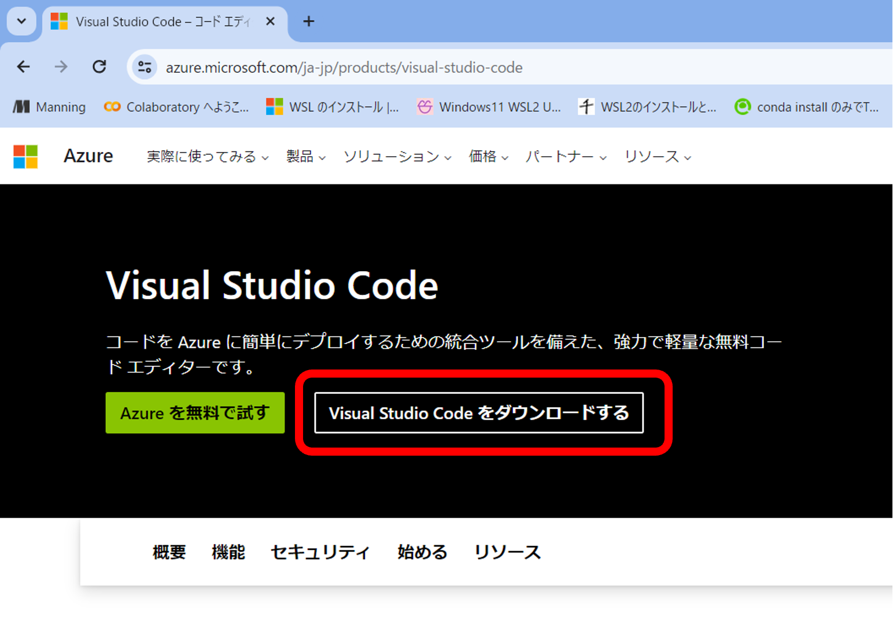
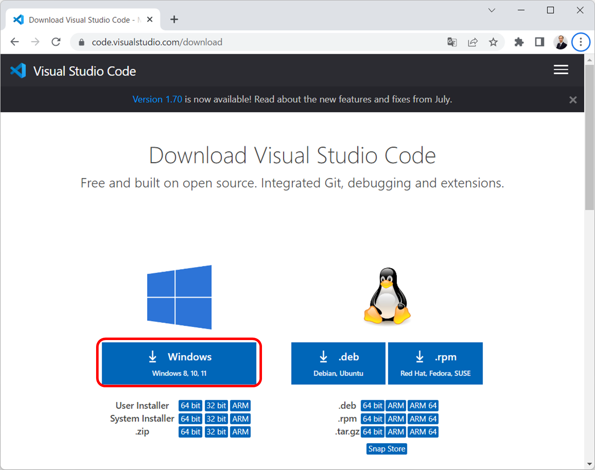
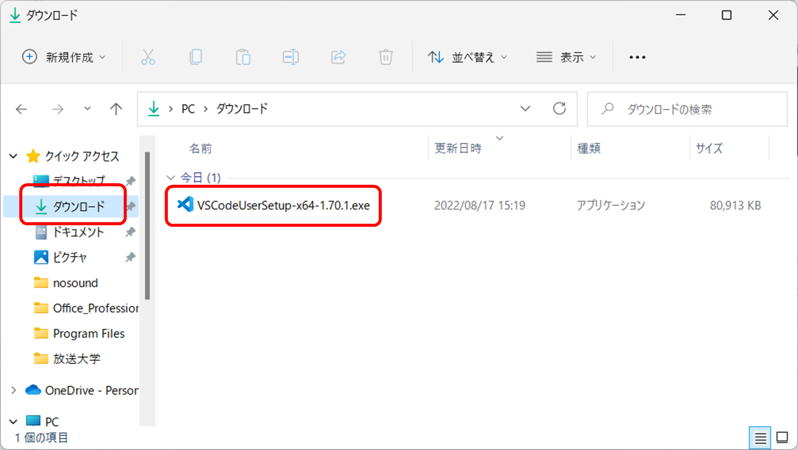
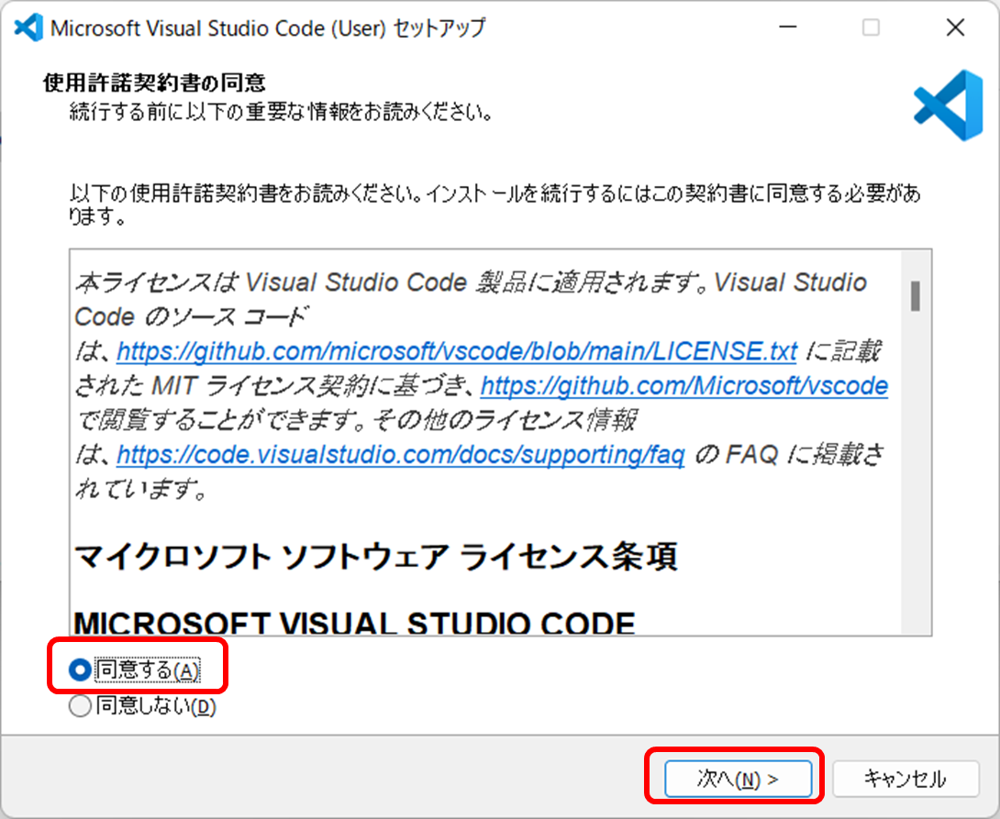
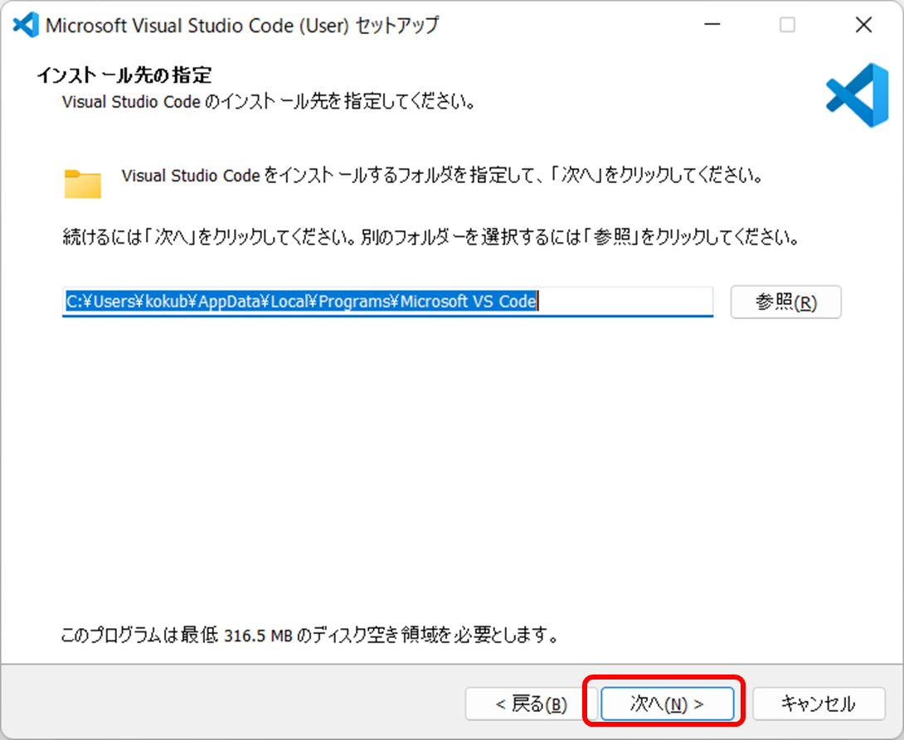
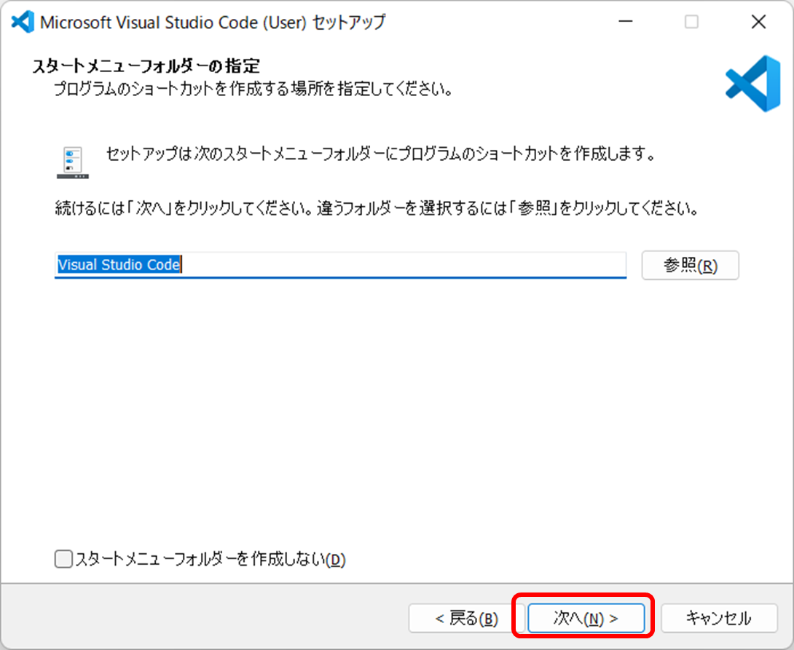
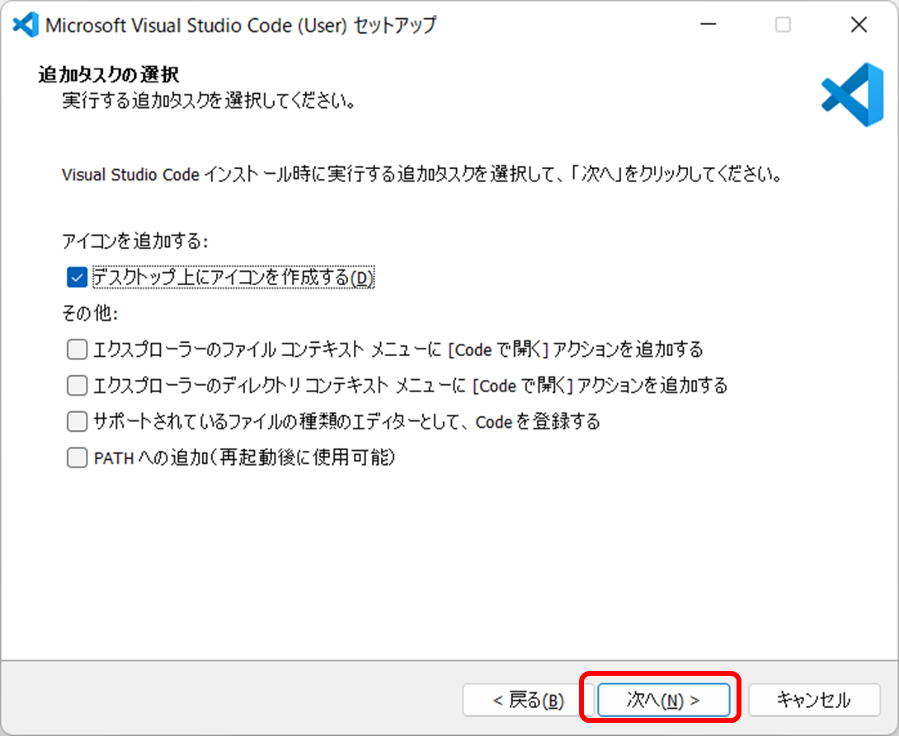
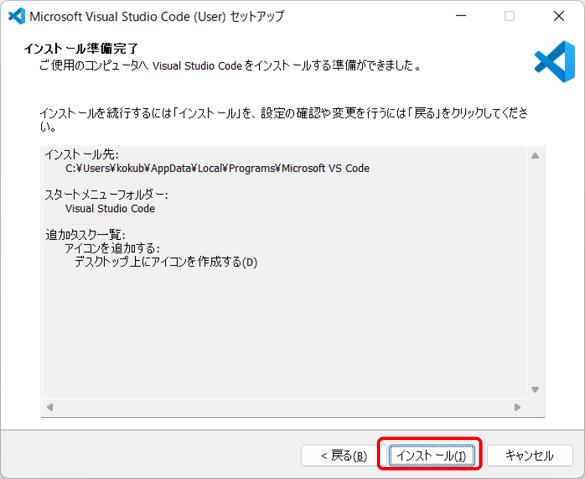
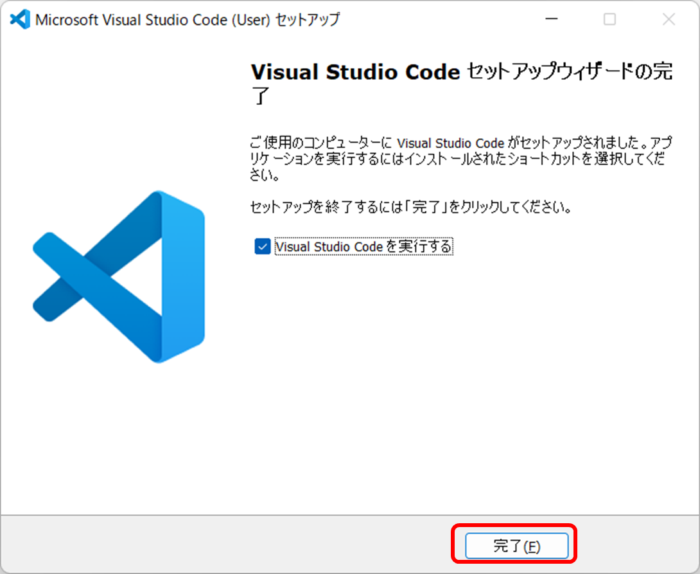

# ​​Visual Studio Codeのインストール

## 1. ブラウザを起動する

## 2. 「visual studio code」で検索する。


## 3. 検索結果から公式サイトの「Visual Studio Code - コードエディター...」を選ぶ


## 4. 公式サイトで「Visual Studio Codeをダウンロードする」を選ぶ

# 

## 5. Windows版を選ぶ



## 6. 「ダウンロード」フォルダにダウンロードされる

「VSCodeUserSetup....exe」のような名前のファイルになる。



## 7. ファイルをダブルクリックしてインストール

## 8. アプリがデバイスに変更を加える許可を求められたら

もしも「このアプリがデバイスに変更を加えることを許可しますか？」と聞かれたら「はい」。
なお、信用できないアプリの場合は「いいえ」。

※出ないかもしれない

## 9. 使用許諾契約書に「同意する」を選んで「次へ」



## 10. 「次へ」



## 11. 「次へ」



## 12. 「デスクトップ上にアイコンを作成する」など、必要と思えるものにチェックを入れ「次へ」



## 13. 「インストール」



## 14. 「完了」



## 15. Visual Studio Codeが起動する
# WSLからVisual Studio Codeを起動

<kbd class="keyboard-key nowrap" lang="en" style="border: 1px solid #aaa; border-radius: 2px; box-shadow: 1px 2px 2px #ddd; background-color: #f9f9f9; background-image: linear-gradient(top, #eee, #f9f9f9, #eee); padding: 1px 3px; font-family: inherit; font-size: 0.85em;"><span class="Unicode">⊞</span> Win</kbd>
+
<kbd class="keyboard-key nowrap" lang="en" style="border: 1px solid #aaa; border-radius: 2px; box-shadow: 1px 2px 2px #ddd; background-color: #f9f9f9; background-image: linear-gradient(top, #eee, #f9f9f9, #eee); padding: 1px 3px; font-family: inherit; font-size: 0.85em;">S</kbd>
で検索を起動し、「ubuntu」を検索し、「Ubuntu」をクリックしてWSLを起動する

WSLで以下のように打つ。

```sh
code
```
